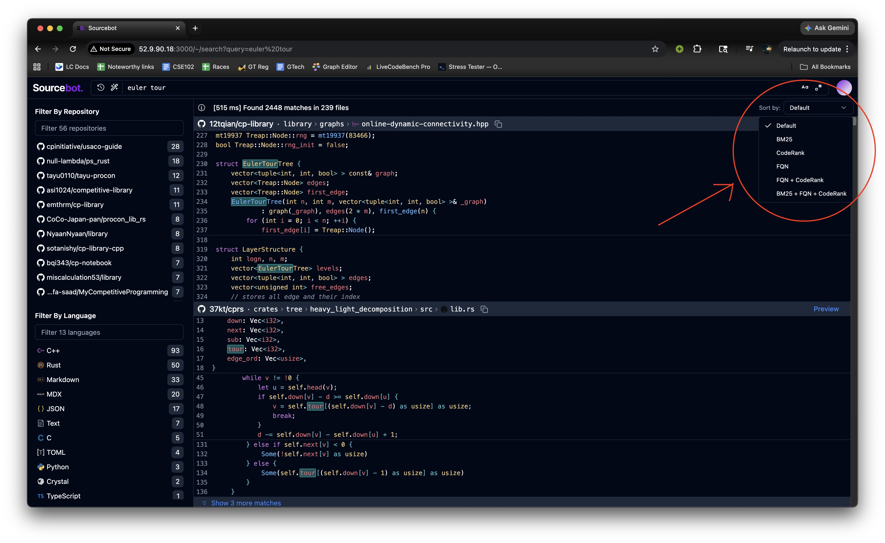

# CS 4675 & 6675 Project

This project is our extension of the open-source code search engine [Sourcebot](https://www.sourcebot.dev/) with the added "sort by" functionality. In total there are 6 different ranking schemes: default, BM25, import-graph PageRank ("CodeRank"), fully-qualified-name (FQN) symbol matching, FQN + CodeRank, and BM25 + FQN + CodeRank.

We have an instance of our modified Sourcebot hosted here (until the semester ends): [http://52.9.90.18:3000](http://52.9.90.18:3000)



## Overview

Sourcebot is a tool for understanding codebases. You can add repositories from popular code hosting sites such as Github, Gitlab, etc. Then, Sourcebot automatically indexes the repositories you added and provides two tools: code search and LLM prompting.

Out of the box, Sourcebot returns search results in the default order (which is a simplified version of BM25). However, some searches can return thousands of results, and it can be hard to manually filter out "good"/"bad" results. We added an experimental "Sort By" feature that introduces different ranking schemes for search results.

## Ranking schemes

The Sort By dropdown has the following six options.

1. **Default** - Sourcebot's original scoring, no heuristics
2. **BM25** - Uses the BM25 scoring heuristic, which considers search term rarity, search term density, and file length normalization. For example, when searching for "Hungarian algorithm", matches with "Hungarian" are weighed higher than matches with "algorithm".
3. **PageRank** - Uses CodeRank, our implementation of the PageRank algorithm. Uses the "import graph": nodes represent files and edges represent file-imports.
4. **FQN (Fully-qualified name)** - Prioritizes matches with the names of packages, classes, and methods over matches with variable names, string literals, and comments.
5. **FQN + CodeRank** - The first pass sorts by the FQN heuristic, the second pass sorts by the CodeRank heuristic.
6. **BM25 + FQN + CodeRank** - The first pass sorts by BM25, then FQN, then CodeRank.

## Experimental setup

### How we ran it

Our custom Sourcebot instance is deployed here: [http://52.9.90.18:3000](http://52.9.90.18:3000). We used mostly default Sourcebot settings. We handpicked a set of 169 repositories with around 82,000 total files for our evaluation. The complete list of repositories is in [`config.json`](config.json).

We chose a set of 8 search queries for our evaluation. For each query we manually evaluated the "ground truth": the most relevant search results. Recall was computed based on the percentage of most relevant results that appeared in the first 10 or 20 results.

Our algorithm parameters are as follows:
- BM25: `k = 1.2`, `b = 0.75`
- PageRank: `dampening factor = 0.85`, `MAX_ITERATIONS = 200`, `CONVERGENCE_EPSILON = 1e-6`
- Scores are normalized to `[0, 1]`

### Open source software package

The sourcebot repo: [https://github.com/sourcebot-dev/sourcebot](https://github.com/sourcebot-dev/sourcebot)

Our extension adds around 800 lines of application code; the existing codebase is >100,000 lines of code. This includes the following:
- Backend pipeline for computing CodeRank scores
- Two API routes for fetching the FQN and CodeRank scores
- Frontend "sort by" dropdown
- Github pipeline for CI/CD

### Benchmark dataset

The below datasets include the 8 search queries, 60 handpicked "best hits" search results, and the positions of the "best hits" for each ranking schema.

#### Queries and ground-truth relevant results

| #   | Query                | Total results | Relevant items |
|-----|----------------------|--------------:|----------------|
| Q1  | GomoryHu             | 31    | (7) Stonefeang `Gomory_Hu.cpp`; bqi343 `GomoryHu.h`; kactl `GomoryHu.h`; ACM_Notebook_new `GomoryHu.h`; fishy15/kactl `GomoryHu.h`; wesley-a-leung `GomoryHu.h`; tfg50 `GomoryHu.hpp` |
| Q2  | Gaussian elimination | 21    | (10) 12tqian `matrix2.hpp`; defnotmee; iagorrr; perdiDev (cpp + java); stevenhalim (cpp + py + java); wesley-a-leung; NyaanNyaan |
| Q3  | Hungarian            | 62    | (7) Stonefeang; bqi343; joney000; maspypy; the-tourist; wesley-a-leung; wery0 |
| Q4  | prime counting       | 84    | (9) ShahjalalShohag; bqi343; KacperTopolski; maksim1744; maspypy `primesum.hpp`; ACM_Notebook_new; tfg50; NyaanNyaan; wery0 |
| Q5  | LiChao               | 131   | (5) KacperTopolski; ahsoltan; brunomaletta; wesley-a-leung; iagorrr |
| Q6  | Knapsack             | 108   | (8) kactl; Kuro-orzz; ShahjalalShohag; biblioteca; hitonanode; iagorrr; wesley-a-leung; bqi343 |
| Q7  | prime factorization  | 79    | (6) ei1333; ningenMe; wery0; kactl; dacin12; glapul |
| Q8  | min                  | 5234  | (7) yokoyama-midori `template.hpp`; shogo314 `more_functional.hpp`; maspypy `monoid/min.hpp`; MtSaka `monoid.hpp`; ZOI-dayo `util.hpp`; anqooqie `monoids.hpp`; shogo314 `utility.hpp` |

#### Positions of relevant items per ranking scheme

Each cell lists the rank position(s) at which the query's relevant items appeared in the corresponding ranking scheme's output.

| Query | Default | BM25 | CodeRank | FQN | FQN + CodeRank | BM25 + FQN + CodeRank |
|---|---|---|---|---|---|---|
| Q1 GomoryHu             | 1, 5, 9, 12, 18, 19, 23                 | 1, 5, 9, 13, 19, 20, 23                | 4, 8, 17, 21, 24, 31, 34               | 1, 3, 5, 7, 10, 11, 13                 | 1, 3, 5, 8, 10, 11, 13                 | 1, 3, 4, 7, 10, 11, 13                |
| Q2 Gaussian elimination | 2, 6, 11, 13, 23, 24, 25, 26, 27, 31    | 1, 6, 11, 14, 23, 24, 25, 27, 28, 31   | 4, 6, 12, 13, 22, 23, 26, 27, 28, 29   | 2, 5, 6, 7, 8, 9, 13, 15, 21, 23       | 2, 5, 6, 7, 8, 9, 13, 15, 20, 23       | 2, 5, 6, 9, 10, 12, 13, 14, 21, 23    |
| Q3 Hungarian            | 11, 15, 32, 33, 54, 60, 61              | 11, 15, 30, 33, 50, 61, 62             | 7, 21, 33, 41, 57, 62, 63              | 7, 9, 18, 20, 29, 34, 35               | 7, 8, 17, 19, 33, 34, 35               | 6, 8, 18, 20, 29, 34, 35              |
| Q4 prime counting       | 9, 19, 28, 33, 46, 57, 60, 76, 85       | 10, 20, 28, 33, 46, 51, 61, 77, 81     | 1, 6, 15, 20, 42, 52, 60, 80, 84       | 6, 12, 16, 18, 26, 29, 41, 46, 76      | 6, 12, 15, 18, 26, 29, 41, 46, 75      | 6, 8, 15, 18, 26, 31, 40, 47, 78      |
| Q5 LiChao               | 5, 26, 41, 127                          | 5, 20, 41, 111                         | 34, 46, 51, 60, 126                    | 4, 16, 21, 65                          | 4, 16, 21, 61                          | 4, 16, 22, 61                         |
| Q6 Knapsack             | 4, 10, 12, 13, 20, 42, 44, 71, 103      | 8, 10, 12, 17, 25, 29, 42, 71, 101     | 6, 37, 41, 46, 48, 58, 60, 95          | 2, 7, 8, 11, 13, 20, 22, 45, 59        | 2, 7, 8, 10, 13, 20, 22, 45, 59        | 5, 7, 8, 10, 13, 20, 22, 45, 60       |
| Q7 prime factorization  | 5, 33, 34, 48, 61, 75                   | 5, 34, 39, 44, 62, 78                  | 4, 6, 19, 47, 54, 76                   | 4, 8, 11, 15, 41, 49                   | 4, 8, 11, 15, 41, 49                   | 4, 8, 11, 15, 41, 49                  |
| Q8 min                  | 246, 683, 798, 2162, 3961, 4001, 5110   | 286, 687, 841, 2145, 3968, 4166, 5081  | 2, 49, 53, 63, 80, 90, 150             | 246, 724, 784, 2046, 3961, 4001, 5110  | 86, 133, 137, 147, 163, 173, 232       | 129, 539, 692, 2135, 4095, 4346, 5022 |


## Deploy Sourcebot

>**NOTE** \
> Sourcebot can be deployed in seconds using Docker Compose. Visit the upstream [docs](https://docs.sourcebot.dev/docs/deployment/docker-compose) for more information.

1. Download the docker-compose.yml file
```sh
curl -o docker-compose.yml https://raw.githubusercontent.com/sourcebot-dev/sourcebot/main/docker-compose.yml
```

2. In the same directory as the `docker-compose.yml` file, create a [configuration file](https://docs.sourcebot.dev/docs/configuration/config-file). The configuration file is a JSON file that configures Sourcebot's behaviour, including what repositories to index, language model providers, auth providers, and more.
```sh
echo '{
    "$schema": "https://raw.githubusercontent.com/sourcebot-dev/sourcebot/main/schemas/v3/index.json",
    // Comments are supported.
    // This config creates a single connection to GitHub.com that
    // indexes the Sourcebot repository
    "connections": {
        "starter-connection": {
            "type": "github",
            "repos": [
                "sourcebot-dev/sourcebot"
            ]
        }
    }
}' > config.json
```

3.  Update the secrets in the `docker-compose.yml` and then run Sourcebot using:
```sh
docker compose up
```

4. Visit `http://localhost:3000` to start using Sourcebot
</br>

To configure Sourcebot (index your own repos, connect your LLMs, etc), check out the upstream [docs](https://docs.sourcebot.dev/docs/configuration/config-file).
